Customer Personality Analysis
================
Michael Czuba
2024-06-16

# Purpose

Customer Personality Analysis is an essential tool for businesses aiming
to understand and segment their customer base effectively. It involves a
comprehensive examination of customers’ preferences, behaviors, and
demographic characteristics, which allows companies to tailor their
products and marketing strategies to meet the specific needs of
different customer segments. This approach not only enhances customer
satisfaction but also optimizes marketing expenditures by targeting the
most receptive audience.

In this analysis, K-Means and Association Rules will be used.

# About the Data

    ## 'data.frame':    2240 obs. of  29 variables:
    ##  $ ID                 : int  5524 2174 4141 6182 5324 7446 965 6177 4855 5899 ...
    ##  $ Year_Birth         : int  1957 1954 1965 1984 1981 1967 1971 1985 1974 1950 ...
    ##  $ Education          : chr  "Graduation" "Graduation" "Graduation" "Graduation" ...
    ##  $ Marital_Status     : chr  "Single" "Single" "Together" "Together" ...
    ##  $ Income             : int  58138 46344 71613 26646 58293 62513 55635 33454 30351 5648 ...
    ##  $ Kidhome            : int  0 1 0 1 1 0 0 1 1 1 ...
    ##  $ Teenhome           : int  0 1 0 0 0 1 1 0 0 1 ...
    ##  $ Dt_Customer        : chr  "04-09-2012" "08-03-2014" "21-08-2013" "10-02-2014" ...
    ##  $ Recency            : int  58 38 26 26 94 16 34 32 19 68 ...
    ##  $ MntWines           : int  635 11 426 11 173 520 235 76 14 28 ...
    ##  $ MntFruits          : int  88 1 49 4 43 42 65 10 0 0 ...
    ##  $ MntMeatProducts    : int  546 6 127 20 118 98 164 56 24 6 ...
    ##  $ MntFishProducts    : int  172 2 111 10 46 0 50 3 3 1 ...
    ##  $ MntSweetProducts   : int  88 1 21 3 27 42 49 1 3 1 ...
    ##  $ MntGoldProds       : int  88 6 42 5 15 14 27 23 2 13 ...
    ##  $ NumDealsPurchases  : int  3 2 1 2 5 2 4 2 1 1 ...
    ##  $ NumWebPurchases    : int  8 1 8 2 5 6 7 4 3 1 ...
    ##  $ NumCatalogPurchases: int  10 1 2 0 3 4 3 0 0 0 ...
    ##  $ NumStorePurchases  : int  4 2 10 4 6 10 7 4 2 0 ...
    ##  $ NumWebVisitsMonth  : int  7 5 4 6 5 6 6 8 9 20 ...
    ##  $ AcceptedCmp3       : int  0 0 0 0 0 0 0 0 0 1 ...
    ##  $ AcceptedCmp4       : int  0 0 0 0 0 0 0 0 0 0 ...
    ##  $ AcceptedCmp5       : int  0 0 0 0 0 0 0 0 0 0 ...
    ##  $ AcceptedCmp1       : int  0 0 0 0 0 0 0 0 0 0 ...
    ##  $ AcceptedCmp2       : int  0 0 0 0 0 0 0 0 0 0 ...
    ##  $ Complain           : int  0 0 0 0 0 0 0 0 0 0 ...
    ##  $ Z_CostContact      : int  3 3 3 3 3 3 3 3 3 3 ...
    ##  $ Z_Revenue          : int  11 11 11 11 11 11 11 11 11 11 ...
    ##  $ Response           : int  1 0 0 0 0 0 0 0 1 0 ...

Upon initially reviewing the data set, we can see that we need to
address our features’ data types. Below is an initial list of the
features that need to be revised:

- Birth year should be transformed into an age feature and should be
  binned
- Education level should be factorized
- Marital status should be factorized
- Income should be numeric
- Dt_Customer should be transformed into a feature that describes how
  long a customer has been doing business with the company
- AcceptedCmp1-AcceptedCmp5 should be binary (yes accepted/no did not
  accept)
- Complain should be made binary (yes complain/ no did not complain)
- Response should be made binary (yes respond/ no did not respond)
- Kidhome and Teenhome should be factorized

After making these changes, redundancy within some of the features is
apparent, listed below:

Additionally, some new features were created. Age was derived from Birth
year and Customer Duration was derived from their Customer Date.

To see if there are missing values:

    ##                  ID           Education      Marital_Status              Income 
    ##                   0                   0                   0                  24 
    ##             Kidhome            Teenhome             Recency            MntWines 
    ##                   0                   0                   0                   0 
    ##           MntFruits     MntMeatProducts     MntFishProducts    MntSweetProducts 
    ##                   0                   0                   0                   0 
    ##        MntGoldProds   NumDealsPurchases     NumWebPurchases NumCatalogPurchases 
    ##                   0                   0                   0                   0 
    ##   NumStorePurchases   NumWebVisitsMonth        AcceptedCmp3        AcceptedCmp4 
    ##                   0                   0                   0                   0 
    ##        AcceptedCmp5        AcceptedCmp1        AcceptedCmp2            Complain 
    ##                   0                   0                   0                   0 
    ##       Z_CostContact           Z_Revenue            Response                 Age 
    ##                   0                   0                   0                   0 
    ##   Customer_Duration 
    ##                   0

According to the R output above, there are 24 missing values in the
Income feature. Due to having a large volume of observations, the 24
records containing missing data will be removed.

    ## `summarise()` has grouped output by 'key', 'total'. You can override using the
    ## `.groups` argument.

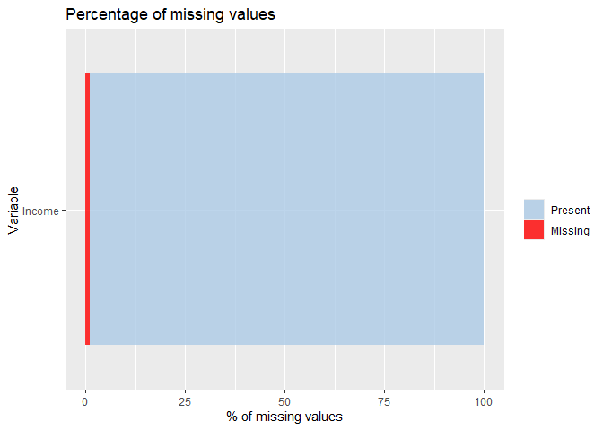<!-- -->

    ## [1] 0

After removal of incomplete records, the total number of observations
drops from 2240 to 2216.

# Exploratory Data Analysis

In order to accurately cluster, variables will be evaluated and records
with outliers will be removed. Additionally, any oddities in categorical
data will be removed. Lastly, all numeric data will be preprocessed for
center and scaling to minimize the effects larger scales have on
clustering algorithms.

## Age

There seems to be a few outliers in our Age feature.

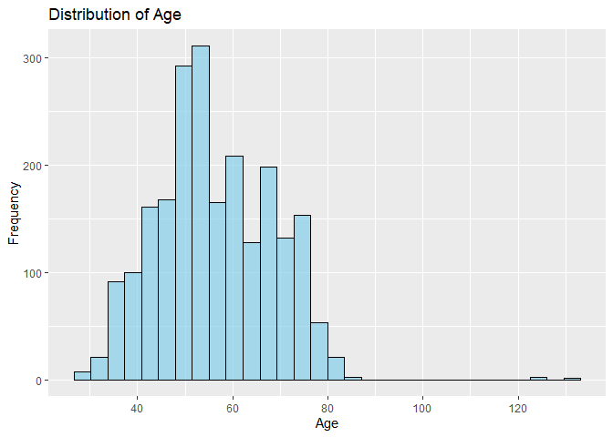<!-- -->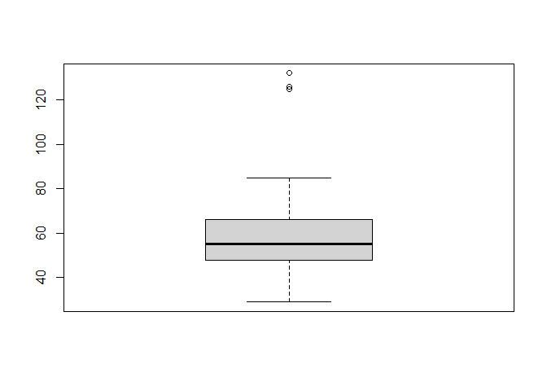<!-- -->

Re-run the histogram and the boxplot to visualize changes

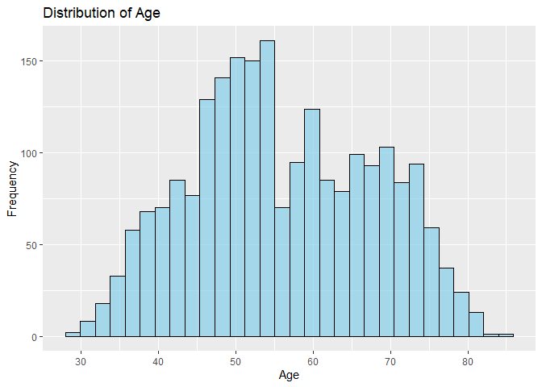<!-- -->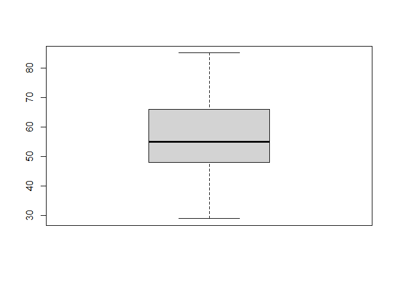<!-- -->
Age is now more normally distributed and the boxplot indicates that
there are no more outliers.

## Education

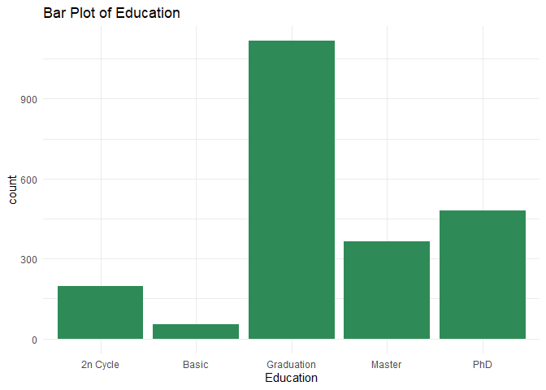<!-- -->

## Marital Status

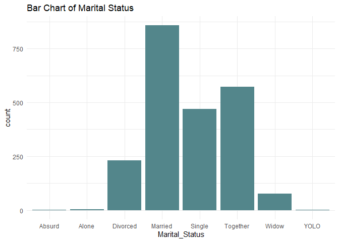<!-- -->

Alone and Single will be combined; Absurd and Yolo observations will be
dropped from the data set.

    ## [1] "Absurd"   "Alone"    "Divorced" "Married"  "Single"   "Together" "Widow"   
    ## [8] "YOLO"

    ## [1] "Absurd"   "Single"   "Divorced" "Married"  "Together" "Widow"    "YOLO"

    ## [1] Single   Together Married  Divorced Widow   
    ## Levels: Single Divorced Married Together Widow

Re-run the plot for Marital Status.

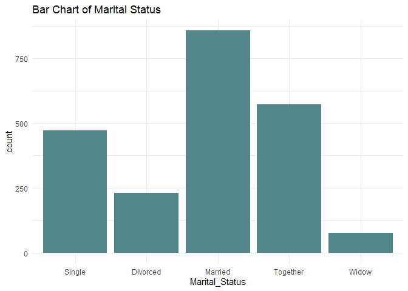<!-- -->

## Income

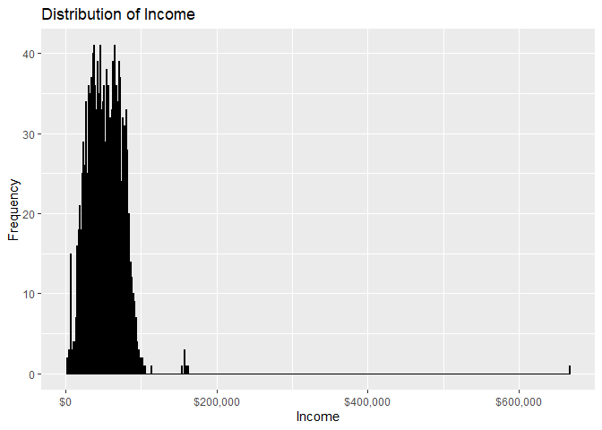<!-- --> There seems to be
outliers present in the Income feature. These outliers will be removed
from the data set.

Re-run the bar plot and the boxplot to visualize the changes.

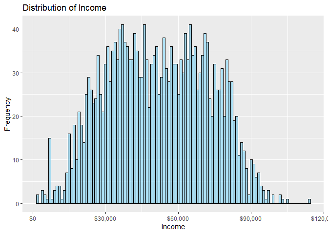<!-- -->

Factorize the Income feature to preserve more descriptive bins for
business use.

    ##  [1] "1-9k"      "10-19k"    "20-29k"    "30-39k"    "40-49k"    "50-59k"   
    ##  [7] "60-69k"    "70-79k"    "80k-89k"   "90k-99k"   "100k-109k" "110k-119k"

Visualization of Income

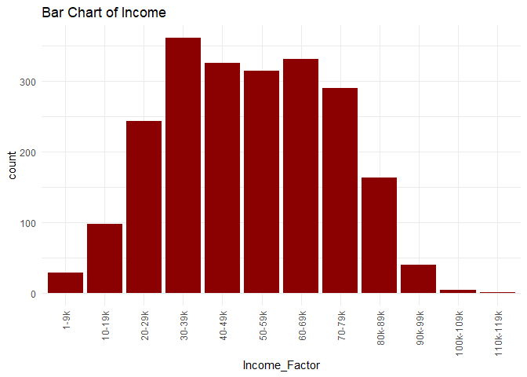<!-- -->

## Household Size

To reduce dimensionality in modeling, KidHome and TeenHome variables
will be combined into a Number of Kids variable and then removed from
the data set.

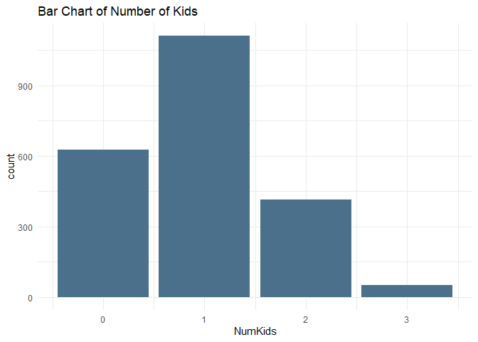<!-- -->

# Creation of data subset by usable category

All variables will be subset into their respective domain and joined
with product categories. Because the goal is to identify cluster
personalities, product category subsets will be analyzed through people
and promotional attributes.

``` r
people_attrs <- dt[, c("Age", "Education", "Marital_Status", "Income_Factor", "NumKids",
                              "Customer_Duration", "Recency", "Complain")]
product_attrs <- dt[, c("MntWines", "MntFruits", "MntMeatProducts", 
                               "MntFishProducts", "MntSweetProducts", "MntGoldProds")]
promotion_attrs <- dt[, c("NumDealsPurchases", "AcceptedCmp1", "AcceptedCmp2", 
                                 "AcceptedCmp3", "AcceptedCmp4", "AcceptedCmp5", "Response")]
place_attrs <- dt[, c("NumWebPurchases", "NumCatalogPurchases", "NumStorePurchases")]
```

``` r
# wine data frame
Wine <- cbind(dt$MntWines, people_attrs, promotion_attrs)

# Food data frame
MntFood <- dt$MntFishProducts + dt$MntMeatProducts + dt$MntFruits
Food <- cbind(MntFood, people_attrs, promotion_attrs)

# Sweets data frame
Sweet <- cbind(dt$MntSweetProducts, people_attrs, promotion_attrs)

# Sweets dataf rame
Gold <- cbind(dt$MntGoldProds, people_attrs, promotion_attrs)
```

# Correlation Plot

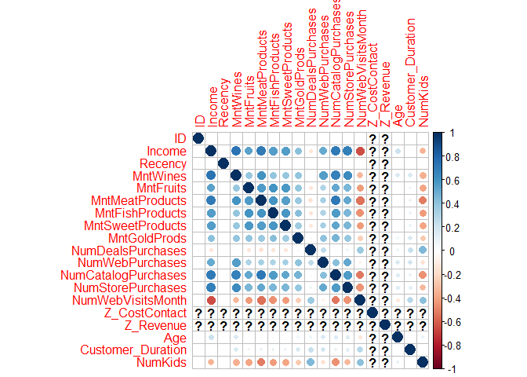<!-- -->

Z_Cost Contact and Z\_-\_Revenue have 0 variance and will be removed
from the data set. In the correlation plot, there are several strong,
positive correlations between income and the amount spent on Wines and
Meat products, as well as store and catalog purchaes. Interestingly,
there is a strong, negative relationship between income and number of
web visits.

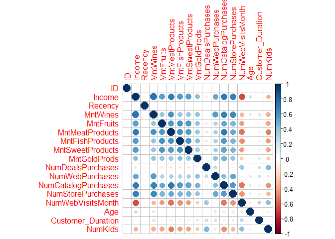<!-- -->

# Modeling

## K-Means

K-Means is, simply put, an unsupervisored clustering algorithm that
groups like data so that the difference within groups is minimized, and
the difference between groups is maximized. In order to prepare for
k-means clustering, and because the algorithm only works with numeric
variables, the data frame will be pre-processed by centering and scaling
the data. As a result, the clusters will be based on the following
variables:

    ##  [1] "Income"              "Recency"             "MntWines"           
    ##  [4] "MntFruits"           "MntMeatProducts"     "MntFishProducts"    
    ##  [7] "MntSweetProducts"    "MntGoldProds"        "NumDealsPurchases"  
    ## [10] "NumWebPurchases"     "NumCatalogPurchases" "NumStorePurchases"  
    ## [13] "NumWebVisitsMonth"   "Age"                 "Customer_Duration"  
    ## [16] "NumKids"

### Elbow Plot

To determine the optimal number of clusters, the elbow plot will be
used. The resulting optimal cluster value is 3.

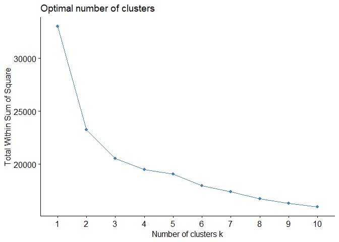<!-- -->

### Initial Cluster Visualization

<!-- -->

## Exploration of Clusters

On initial inspection of clusters, cluster 2 has the most customers with
1038.

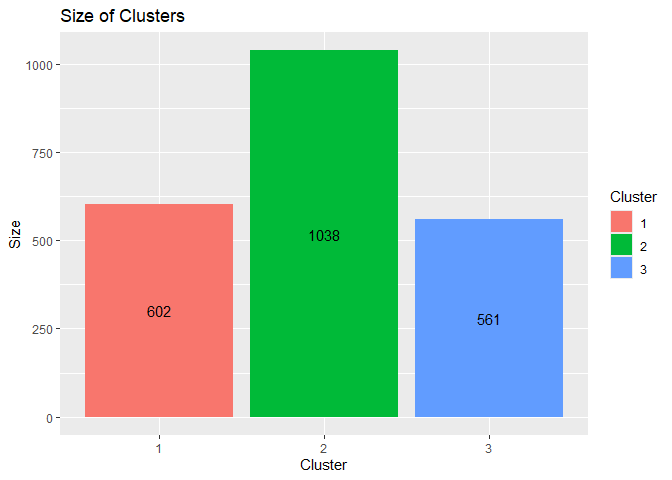<!-- -->

### Exploring Amount Spent per Cluster

Despite it’s size, Cluster 2 spend the least amount of money on
products, where cluster 1 spend the overwhelming majority.

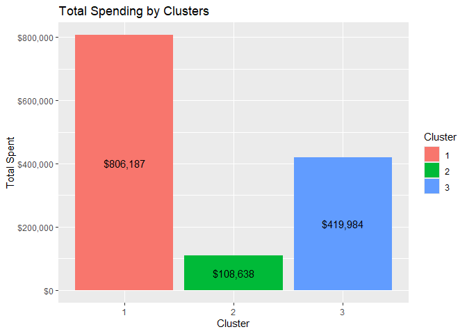<!-- -->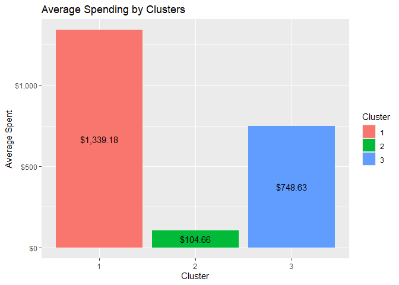<!-- -->

### Income per Cluster

Cluster 1 has the high maximum and median income, where as cluster 2,
the largest sized cluster, has the smallest. This could be an
influential reason as to their limited spending habits, and why Cluster
1 has the highest spending and spending average.

<!-- -->

### Number of Kids and Spending

Furthering the income analysis above, by visualizing the number of kids
alongside total spending, we can see that while clusters 2 and 3 have
less income, they also have dependent as a financial concern,
potentially limiting their spendable income and highlighting their price
sensitivity.

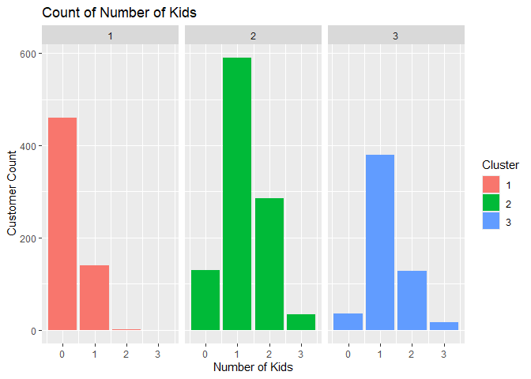<!-- -->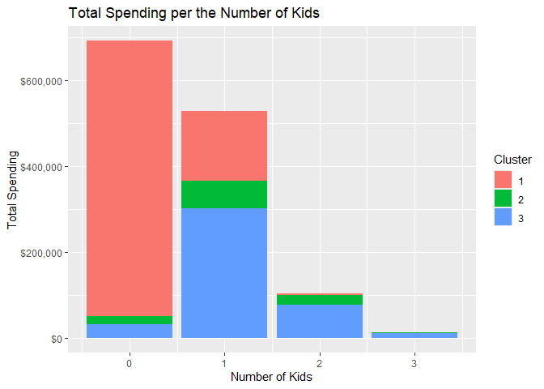<!-- -->

### recency since Last Purchase

There are marginal differences in how recently customers of each cluster
ordered. However, when comparing the cluster average to the average
across all clusters, we can see that cluster 2 has more customers in it
who have purchase more frequently than the average. Looking at the
histogram faceted by Cluster, we can see Cluster 2 has a multi-modal
distribution with peaks around the tails of values which is not as
drastically present in cluster 1 and 3, which could be skewing the
boxplot analysis. Accounting for size, this could indicate a shifting
trend in more effective targeted advertisement subsequently increasing
average spent per cluster average; however, Cluster 2 has the lowest
median income which could be the overall limiting factor.

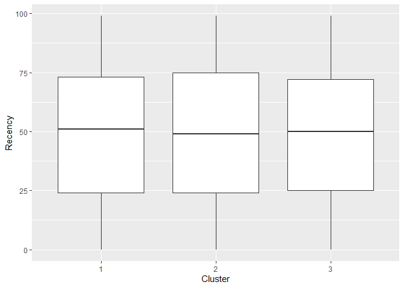<!-- -->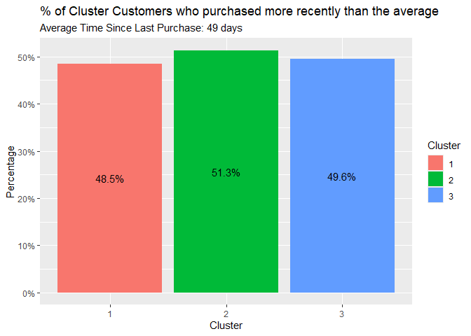<!-- -->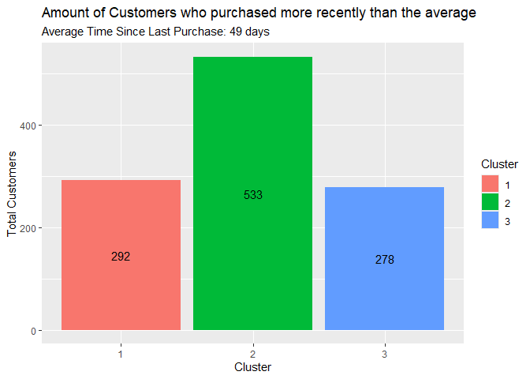<!-- -->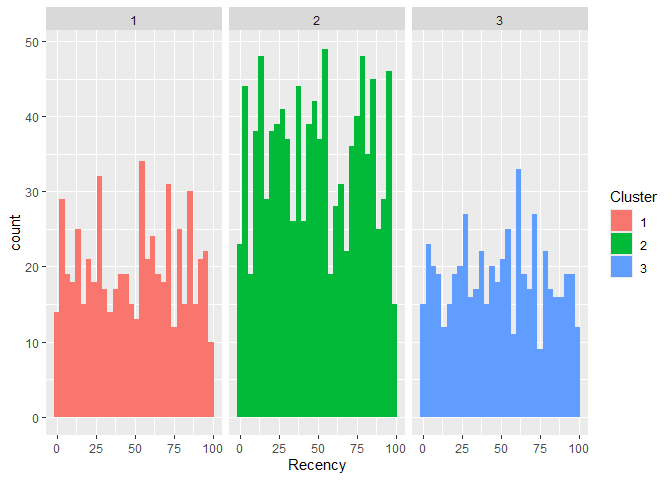<!-- -->

### Responsiveness to Targeted Campaigns

Cluster 1 has been the most receptive to campaigns, with over 20% of the
cluster accepting each of the last 2 campaigns. Cluster 2 has been
largely non-responsive; accepting under 5% in 4 of the 6 campaigns.
However, over 10% accepted the most recent campaign which, depending on
timing, could explain the cluster’s spike in recency since last
purchase.

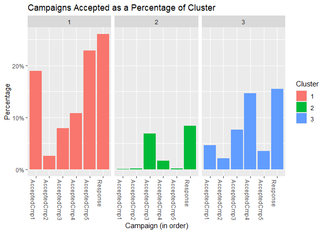<!-- -->

### Product Category Purchase Totals by Cluster

Wines and meat products account for the largest sum of sales, with
clusters 1 and 3 accounting for the majority, respectively. Across all
categories, Cluster 2, while being the largest cluster, purchases the
least amount in all categories. By percentage, 75% of Cluster 2
customers purchased more luxurious products like Fish, Gold, and Sweets.
This indicates a willingness to purchase the product but could be
excluded from purchasing more based on their income. Respective to the
cluster size, one way to boost total sales in these categories is to
offer more price conscious offerings or targeted deals.

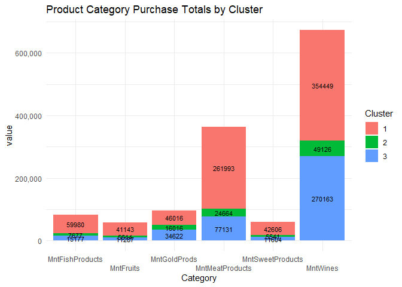<!-- -->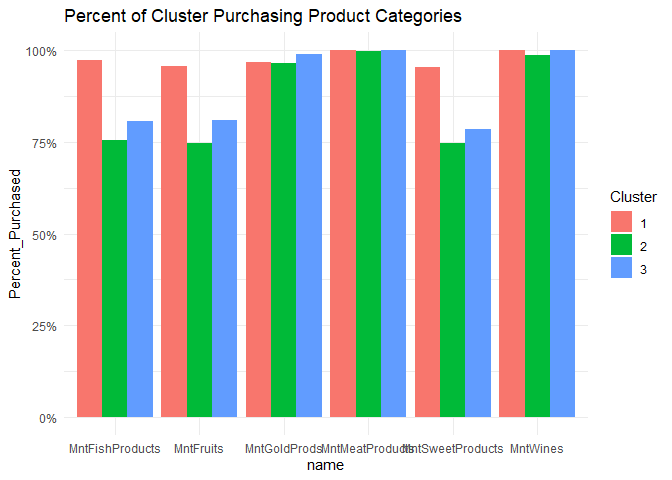<!-- -->

### Place of Purchase per Customer

Store and Web purchases account for the most purchases, respectively.
Additionally, this is the trend across all of the clusters with the
exception of Cluster 1, who has more purchases through the catalog than
the web. While there are no previous metrics to base this off of, almost
100% of cluster 2 visited the website in the last month. This is a good
indication that they are not inactive customers. It is worth noting that
almost 25% of cluster 1 has not visited the website in the last month.
Their preference to the catalog over the web could suggest that the
website is not showcasing the products cluster 1 is looking to purchase,
in their preferred manner. Given this cluster is accounts for the most
sales, a redesign of the website could be beneficial for sustaining
their engagement. Alternatively, the catalog could be a way of keeping
the company fresh in their minds in the event the cluster does not check
promotional emails.

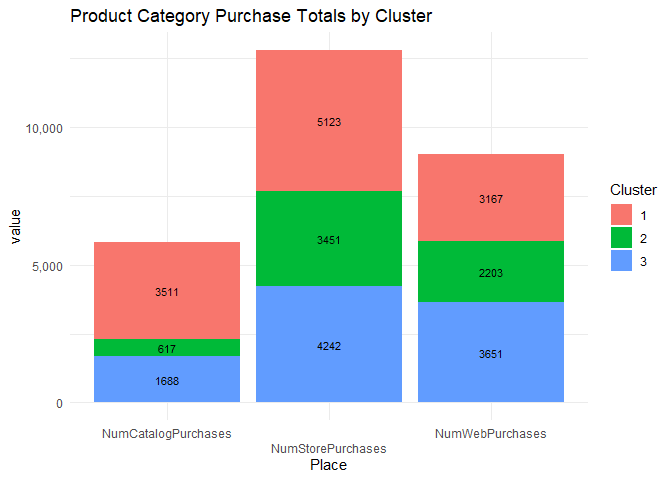<!-- -->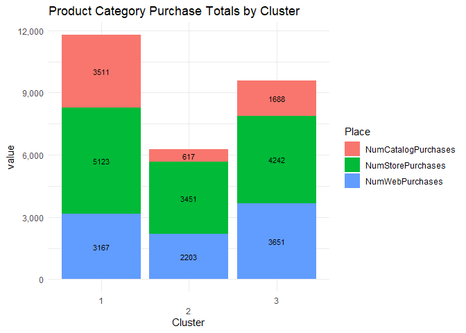<!-- -->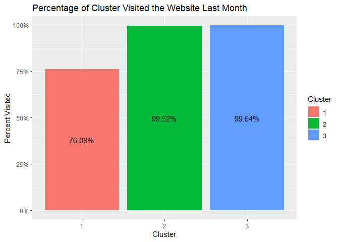<!-- -->

### Total Spending and Deals Purchased

We can see a positive relationship between the amount spent and a
customers income. Knowing income is not equally distributed across all
clusters, we can see the highest earners in Cluster 1 do not purchases
as many deals as clusters 2 and 3. As a stacked chart, we can see the
parabolic relationship; where as deals increases as income increased
until after around \$59k, where as income increases, deals decreases.
This indicates price sensitivity of the clusters and customer groups.
Further data is needed for analysis on how the deals affects product
category purchases in total, and within clusters.

<!-- -->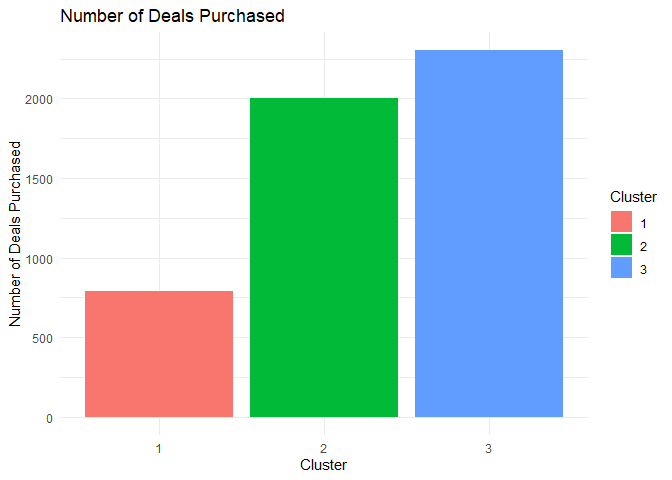<!-- -->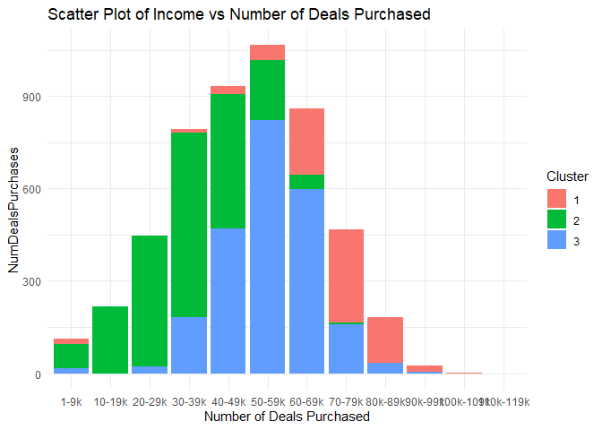<!-- -->

## Association Rules

Association Rules are a data mining technique to uncover hidden
relationships between variables. High purchases for Food, Wine, Sweet,
and Gold product categories will be mined based on “High” being
calcualated as the top quartile in that spending category. The Apriori
algorithm will be used in this analysis.

### Food Association Rules

Looking at the first 5 rules, by lift, we can see that having an income
of \$80-89k is a common feature across the rules. Additionally worth
noting, A high food spender would have purchased 1 deal and not accepted
Campaigns 2, 3, or 4. This is an important discovery as it shows an
ineffective target if that was the intent of the campaign.

    ##   0%  25%  50%  75% 100% 
    ##    1   25   91  356 1727

    ## Apriori
    ## 
    ## Parameter specification:
    ##  confidence minval smax arem  aval originalSupport maxtime support minlen
    ##         0.8    0.1    1 none FALSE            TRUE       5    0.05      1
    ##  maxlen target  ext
    ##       5  rules TRUE
    ## 
    ## Algorithmic control:
    ##  filter tree heap memopt load sort verbose
    ##     0.1 TRUE TRUE  FALSE TRUE    2    TRUE
    ## 
    ## Absolute minimum support count: 110 
    ## 
    ## set item appearances ...[1 item(s)] done [0.00s].
    ## set transactions ...[54 item(s), 2201 transaction(s)] done [0.00s].
    ## sorting and recoding items ... [44 item(s)] done [0.00s].
    ## creating transaction tree ... done [0.00s].
    ## checking subsets of size 1 2 3 4 5 done [0.02s].
    ## writing ... [80 rule(s)] done [0.00s].
    ## creating S4 object  ... done [0.00s].

    ##     lhs                           rhs                        support confidence   coverage     lift count
    ## [1] {Income_Factor=80k-89k,                                                                              
    ##      AcceptedCmp4=0}           => {MntFood_Category=High} 0.05588369  0.9111111 0.06133576 3.646101   123
    ## [2] {Income_Factor=80k-89k,                                                                              
    ##      NumDealsPurchases=[1,2),                                                                            
    ##      AcceptedCmp3=0}           => {MntFood_Category=High} 0.05043162  0.9098361 0.05542935 3.640999   111
    ## [3] {Income_Factor=80k-89k,                                                                              
    ##      Complain=0,                                                                                         
    ##      NumDealsPurchases=[1,2),                                                                            
    ##      AcceptedCmp3=0}           => {MntFood_Category=High} 0.05043162  0.9098361 0.05542935 3.640999   111
    ## [4] {Income_Factor=80k-89k,                                                                              
    ##      AcceptedCmp2=0,                                                                                     
    ##      AcceptedCmp4=0}           => {MntFood_Category=High} 0.05497501  0.9097744 0.06042708 3.640752   121
    ## [5] {Income_Factor=80k-89k,                                                                              
    ##      Complain=0,                                                                                         
    ##      AcceptedCmp4=0}           => {MntFood_Category=High} 0.05497501  0.9097744 0.06042708 3.640752   121

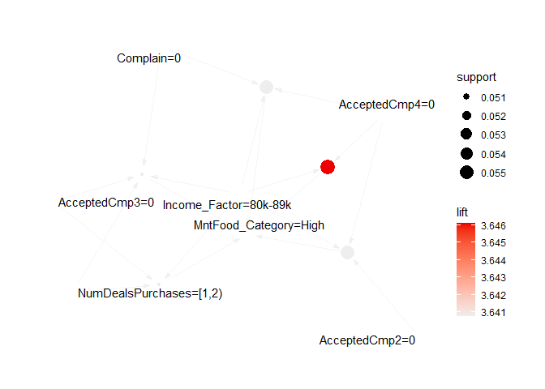<!-- -->

### Wine Rules

To be a high spender in wine, the most common association across the
first 5 rules (by lift), is that the customer would have accepted
campaign 5. If the

    ##   0%  25%  50%  75% 100% 
    ##    0   24  176  507 1493

    ## Apriori
    ## 
    ## Parameter specification:
    ##  confidence minval smax arem  aval originalSupport maxtime support minlen
    ##         0.8    0.1    1 none FALSE            TRUE       5    0.05      1
    ##  maxlen target  ext
    ##       5  rules TRUE
    ## 
    ## Algorithmic control:
    ##  filter tree heap memopt load sort verbose
    ##     0.1 TRUE TRUE  FALSE TRUE    2    TRUE
    ## 
    ## Absolute minimum support count: 110 
    ## 
    ## set item appearances ...[1 item(s)] done [0.00s].
    ## set transactions ...[54 item(s), 2201 transaction(s)] done [0.00s].
    ## sorting and recoding items ... [44 item(s)] done [0.00s].
    ## creating transaction tree ... done [0.00s].
    ## checking subsets of size 1 2 3 4 5 done [0.02s].
    ## writing ... [8 rule(s)] done [0.00s].
    ## creating S4 object  ... done [0.00s].

    ##     lhs                  rhs                        support confidence   coverage     lift count
    ## [1] {AcceptedCmp2=0,                                                                            
    ##      AcceptedCmp5=1}  => {MntWine_Category=High} 0.05633803  0.8671329 0.06497047 3.470108   124
    ## [2] {NumKids=[0,1),                                                                             
    ##      AcceptedCmp5=1}  => {MntWine_Category=High} 0.05315766  0.8666667 0.06133576 3.468242   117
    ## [3] {Complain=0,                                                                                
    ##      AcceptedCmp2=0,                                                                            
    ##      AcceptedCmp5=1}  => {MntWine_Category=High} 0.05588369  0.8661972 0.06451613 3.466364   123
    ## [4] {NumKids=[0,1),                                                                             
    ##      Complain=0,                                                                                
    ##      AcceptedCmp5=1}  => {MntWine_Category=High} 0.05270332  0.8656716 0.06088142 3.464261   116
    ## [5] {AcceptedCmp5=1}  => {MntWine_Category=High} 0.06269877  0.8625000 0.07269423 3.451568   138

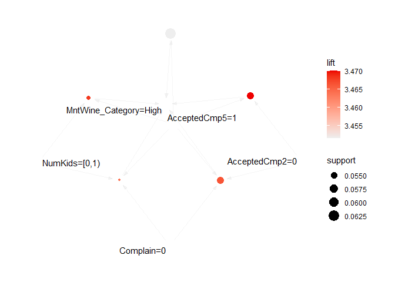<!-- -->

### Sweet Rules

The most common association rules for Sweet are having an income between
\$70-89k. It is worth noting that, in these rules, we only have less
than 70% confidence that they would lead to high spending in sweets.

    ##   0%  25%  50%  75% 100% 
    ##    0    1    8   34  262

    ## Apriori
    ## 
    ## Parameter specification:
    ##  confidence minval smax arem  aval originalSupport maxtime support minlen
    ##         0.6    0.1    1 none FALSE            TRUE       5    0.05      1
    ##  maxlen target  ext
    ##       5  rules TRUE
    ## 
    ## Algorithmic control:
    ##  filter tree heap memopt load sort verbose
    ##     0.1 TRUE TRUE  FALSE TRUE    2    TRUE
    ## 
    ## Absolute minimum support count: 110 
    ## 
    ## set item appearances ...[1 item(s)] done [0.00s].
    ## set transactions ...[54 item(s), 2201 transaction(s)] done [0.00s].
    ## sorting and recoding items ... [44 item(s)] done [0.00s].
    ## creating transaction tree ... done [0.00s].
    ## checking subsets of size 1 2 3 4 5 done [0.02s].
    ## writing ... [81 rule(s)] done [0.00s].
    ## creating S4 object  ... done [0.00s].

    ##     lhs                           rhs                         support confidence   coverage     lift count
    ## [1] {Income_Factor=80k-89k,                                                                               
    ##      Complain=0}               => {MntSweet_Category=High} 0.05088596  0.6956522 0.07314857 2.819761   112
    ## [2] {Income_Factor=80k-89k}    => {MntSweet_Category=High} 0.05134030  0.6932515 0.07405725 2.810031   113
    ## [3] {Education=Graduation,                                                                                
    ##      Income_Factor=70-79k,                                                                                
    ##      AcceptedCmp2=0}           => {MntSweet_Category=High} 0.05224898  0.6845238 0.07632894 2.774654   115
    ## [4] {Education=Graduation,                                                                                
    ##      Income_Factor=70-79k,                                                                                
    ##      Complain=0,                                                                                          
    ##      AcceptedCmp2=0}           => {MntSweet_Category=High} 0.05224898  0.6845238 0.07632894 2.774654   115
    ## [5] {Income_Factor=70-79k,                                                                                
    ##      NumDealsPurchases=[1,2),                                                                             
    ##      AcceptedCmp3=0,                                                                                      
    ##      AcceptedCmp4=0}           => {MntSweet_Category=High} 0.05134030  0.6807229 0.07542026 2.759247   113

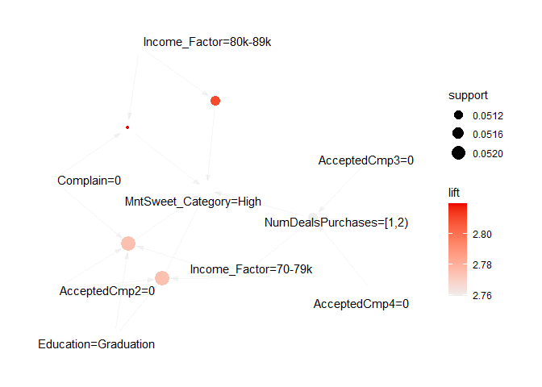<!-- -->

### Gold Rules

When sorting by lift, the most common association is that they have an
income between \$70-79k; however, much like with sweets, the confidence
in these associations leading to high spenders in gold is below 50%.

    ##   0%  25%  50%  75% 100% 
    ##    0    9   25   56  321

    ## Apriori
    ## 
    ## Parameter specification:
    ##  confidence minval smax arem  aval originalSupport maxtime support minlen
    ##         0.3    0.1    1 none FALSE            TRUE       5    0.05      1
    ##  maxlen target  ext
    ##       5  rules TRUE
    ## 
    ## Algorithmic control:
    ##  filter tree heap memopt load sort verbose
    ##     0.1 TRUE TRUE  FALSE TRUE    2    TRUE
    ## 
    ## Absolute minimum support count: 110 
    ## 
    ## set item appearances ...[1 item(s)] done [0.00s].
    ## set transactions ...[54 item(s), 2201 transaction(s)] done [0.00s].
    ## sorting and recoding items ... [44 item(s)] done [0.00s].
    ## creating transaction tree ... done [0.00s].
    ## checking subsets of size 1 2 3 4 5 done [0.02s].
    ## writing ... [295 rule(s)] done [0.00s].
    ## creating S4 object  ... done [0.00s].

    ##     lhs                        rhs                        support confidence  coverage     lift count
    ## [1] {Income_Factor=70-79k}  => {MntGold_Category=High} 0.06315311  0.4793103 0.1317583 1.921607   139
    ## [2] {Income_Factor=70-79k,                                                                           
    ##      Complain=0}            => {MntGold_Category=High} 0.06315311  0.4793103 0.1317583 1.921607   139
    ## [3] {Income_Factor=70-79k,                                                                           
    ##      AcceptedCmp2=0}        => {MntGold_Category=High} 0.06224443  0.4773519 0.1303953 1.913755   137
    ## [4] {Income_Factor=70-79k,                                                                           
    ##      Complain=0,                                                                                     
    ##      AcceptedCmp2=0}        => {MntGold_Category=High} 0.06224443  0.4773519 0.1303953 1.913755   137
    ## [5] {Income_Factor=70-79k,                                                                           
    ##      AcceptedCmp4=0}        => {MntGold_Category=High} 0.05633803  0.4750958 0.1185825 1.904710   124

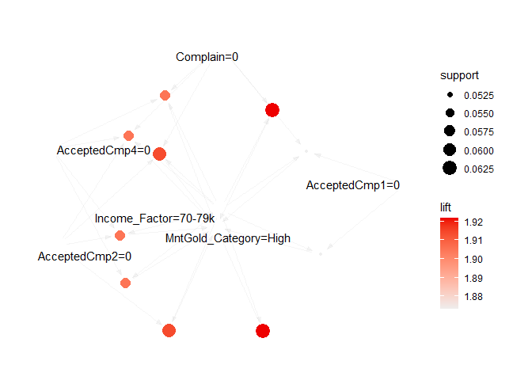<!-- -->

# Conclusion

Given the disparity of income and spending across clusters and product
categories, a price sensitivity analysis should be conducted to
determine how effective the item offerings are translating to sales. By
the percentages, members of all clusters are purchasing products across
all product categories; as such, the business should acknowledge the
size of the clusters and the potential that they might not be offering
products at the correct price point to entice the sales across their
customer base. Additionally, deal purchases are highest around the mean
income; to further drive sales, promotional offerings need to be more
directly targeted at the consumers with respect to their cluster and
income. The high earners and spenders of Cluster 1 show to not be
interacting with the web design despite each customer spending, on
average, just over \$1300. By redesigning the website to be more
catering to their needs, the duration since their last purchase can be
shortened and perhaps, increase in frequency as they would not be
waiting on catalog mail before purchasing. Additionally, with the more
price sensitive/income limited customers in clusters 2 and 3, we see the
largest volume of deals purchased. A limited deal of a lower priced
luxury item could be offered to spur sales from them. This maintains
brand image and does not dilute quality, while maintaining an active
customer base. Tailored campaigns focusing on essential products and
cost-saving offers could better engage low-income customers, enhancing
their loyalty and satisfaction.
